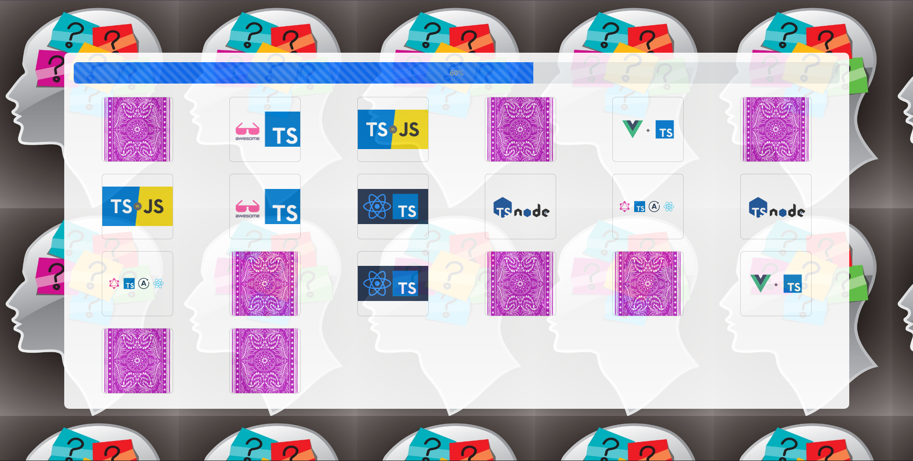
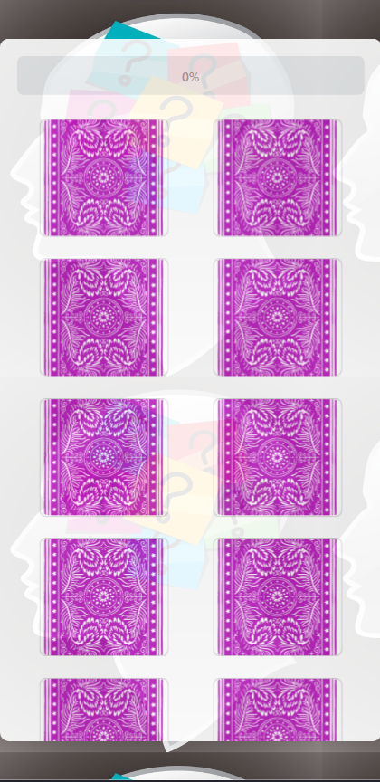
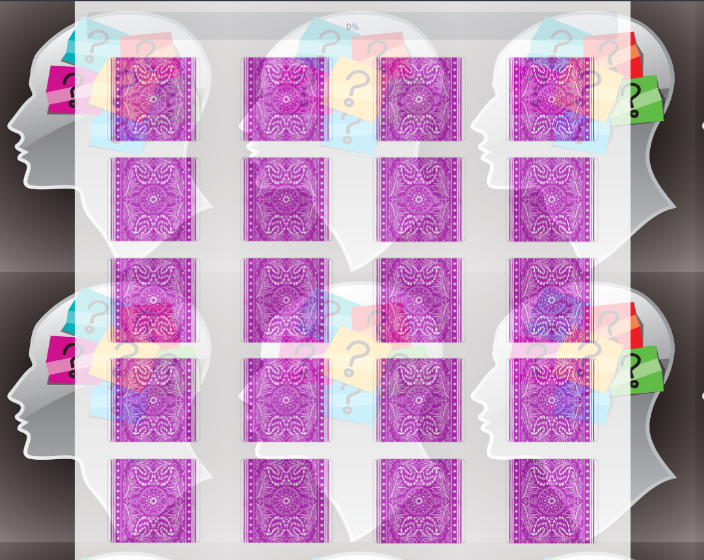
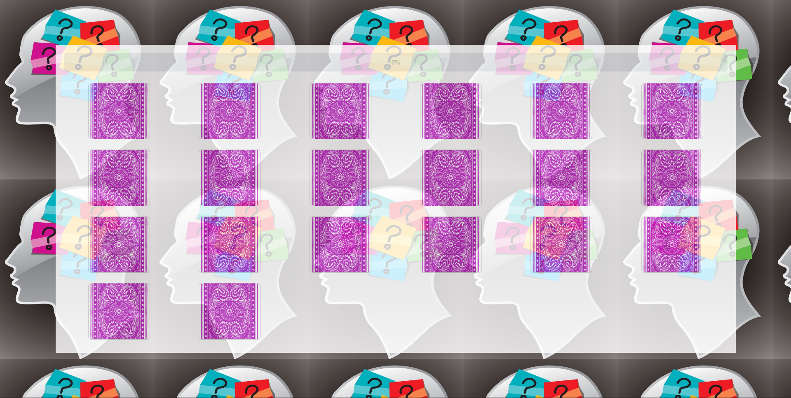

# 🧠 Memory Card Game

A simple memory matching game built with TypeScript, HTML, CSS, and Bootstrap.  
Flip the cards, match the pairs, and track your progress with a progress bar.

## 🛠️ Tech Stack
- **TypeScript** for game logic
- **HTML / CSS** for layout and styling
- **Bootstrap 5** for responsive design

## 🚀 Features
- 🎴 Flip cards and find matching pairs
- 📊 Animated progress bar showing completion
- 🔊 Sound effects for flipping and correct matches
- 📱 Responsive design (works on mobile and desktop)

## 🎮 Gameplay

## 📱 Responsiveness
### Small screen

### Medium screen

### Large screen

